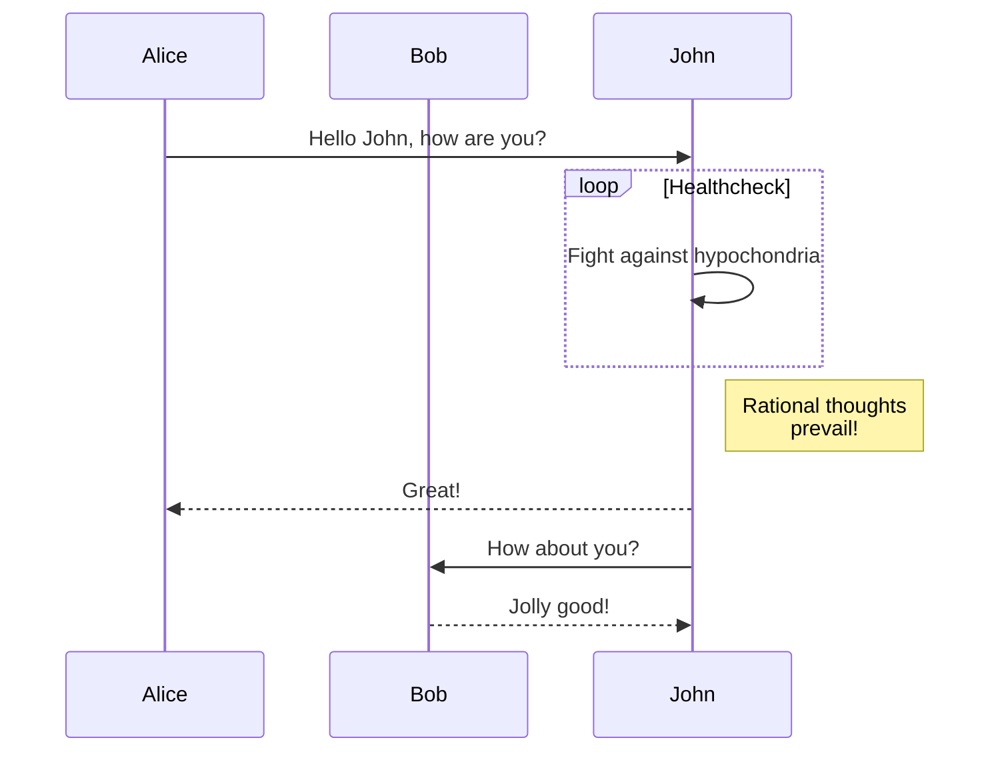

# Features Test

[TOC]

## Math (LaTeX)

Block math:

```math
f(x) = \int_{-\infty}^\infty \hat f(\xi)\,e^{2\pi i \xi x} \,d\xi
```

Inline math: The value of $$x$$ is $$x^2$$.

## Flowchart

```flow
st=>start: Start
op=>operation: Your Operation
cond=>condition: Yes or No?
e=>end

st->op->cond
cond(yes)->e
cond(no)->op
```

## Sequence Diagram

```sequence
Alice->Bob: Hello Bob, how are you?
Note right of Bob: Bob thinks
Bob-->Alice: I am good thanks!
```
[README.md](README.md)
## Mermaid Sequence (Standard)


