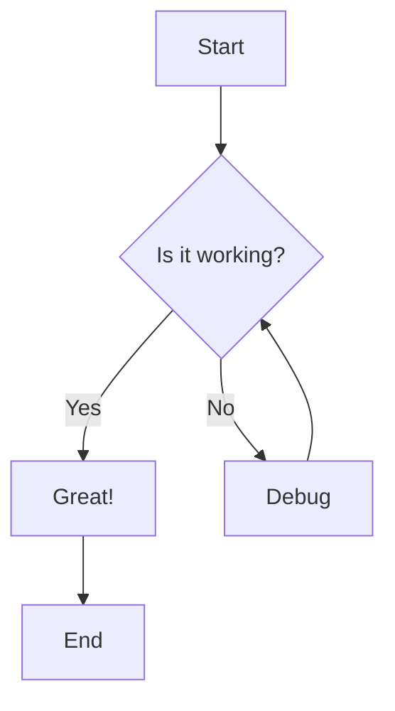
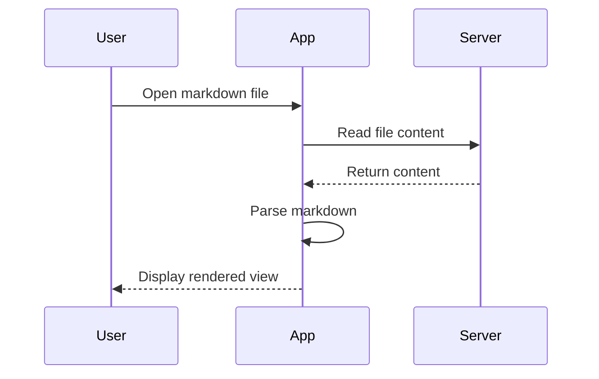

# MD Viewer Test File

This file tests all the markdown features.

## Tables

| Feature           | Status     | Notes               |
| ----------------- | ---------- | ------------------- |
| Tables            | ✅ Working | Full GFM support    |
| Code Highlighting | ✅ Working | highlight.js        |
| Mermaid Diagrams  | ✅ Working | Dark theme          |
| Headers           | ✅ Working | All levels          |
| Lists             | ✅ Working | Ordered & Unordered |

## Code with Syntax Highlighting

### JavaScript

```javascript
function greet(name) {
  const message = `Hello, ${name}!`;
  console.log(message);
  return message;
}

const result = greet("World");
```

### Python

```python
def fibonacci(n):
    if n <= 1:
        return n
    return fibonacci(n-1) + fibonacci(n-2)

# Generate first 10 numbers
for i in range(10):
    print(fibonacci(i))
```

### CSS

```css
.container {
  display: flex;
  justify-content: center;
  background: linear-gradient(135deg, #7c3aed, #a855f7);
  border-radius: 16px;
}
```

## Mermaid Diagrams

### Flowchart



### Sequence Diagram



## Other Features

> This is a blockquote with some **bold** and _italic_ text.

### Lists

- Unordered item 1
- Unordered item 2
  - Nested item
  - Another nested item
- Unordered item 3

1. Ordered item 1
2. Ordered item 2
3. Ordered item 3

### Text Formatting

This is **bold**, this is _italic_, and this is ~~strikethrough~~.

This is `inline code` within a paragraph.

---

_End of test file_
